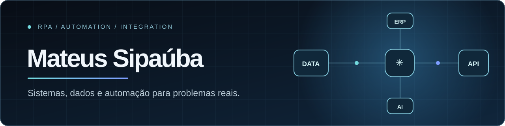

  

  <strong>Sistemas corporativos · Automação de processos · Integrações</strong>

  <a href="https://github.com/Sipauba/meu_portifolio">Portfólio (código)</a> ·
  <a href="https://www.linkedin.com/in/mateussipauba/">LinkedIn</a> ·
  <a href="mailto:mateus.sipauba@yahoo.com.br">E-mail</a>

## Sobre mim

Atuo com sistemas corporativos e infraestrutura: atendimento a usuários do ERP WinThor, administração do GLPI, acessos e permissões, consultas e relatórios em Oracle/SQL, Active Directory, Docker, VPS e monitoramento de serviços. A partir dessas demandas, desenvolvo automações em Python e n8n, integrações entre sistemas e soluções com IA para reduzir etapas manuais e organizar processos.

Tenho interesse em oportunidades de **RPA, automação, integrações e desenvolvimento de soluções internas**.

## Projetos para conhecer

- **[Glados · Assistente de TI](https://github.com/Sipauba/glados-assitente-ti)** — atendimento e consultas operacionais com n8n, OpenAI, GLPI, Oracle e Redis.
- **[Bot de cobrança](https://github.com/Sipauba/bot-cobranca)** — consulta de títulos, validação de contatos e notificações via WhatsApp.
- **[Pinga ni mim](https://github.com/Sipauba/pinga_ni_mim)** — monitoramento de hosts e serviços web com painel e alertas de indisponibilidade.

Os repositórios fixados abaixo mostram outros projetos de integração, autoatendimento e dados.

## Ferramentas que uso

- **Automação e IA:** n8n · Python · JavaScript · OpenAI
- **Dados e sistemas:** Oracle · MySQL · PostgreSQL · Redis · GLPI · WinThor
- **Integrações e infraestrutura:** APIs REST · Webhooks · WhatsApp APIs · Docker · Linux
